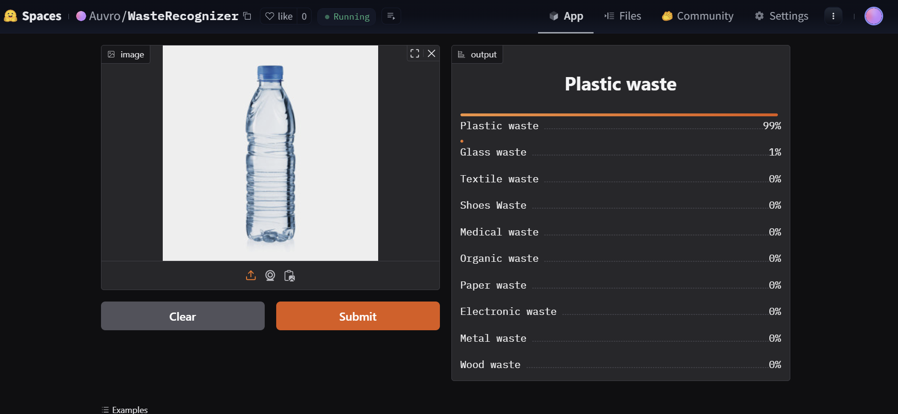

# 🌍 Waste Recognition Model for Environmental Sustainability

## 📌 Overview
The **Waste Recognition Model** is a deep-learning-based solution designed to classify various types of waste materials with high accuracy. By integrating AI-powered waste classification, this project aims to enhance waste management efficiency, reduce environmental pollution, and promote sustainable waste disposal practices.

## 🎯 Key Features
- **Accurate Waste Classification**: Identifies waste materials across multiple categories.
- **Disposal Recommendations**: Suggests proper disposal methods to minimize environmental impact.
- **Real-Time Processing**: Provides quick and efficient waste recognition for seamless integration into waste management systems.
- **User-Friendly Interface**: Accessible via a web-based application.
- **Versatile Deployment**: Can be used in homes, offices, and industrial waste management systems.
- **Environmental Impact**: Reduces contamination and promotes sustainable waste disposal.

## 🏷️ Waste Categories
The model is trained to classify waste into the following categories:
1. **Plastic Waste** - Bottles, wrappers, straws, bags.
2. **Metal Waste** - Aluminum, copper, iron, steel.
3. **Organic Waste** - Food waste, yard waste.
4. **Glass Waste** - Bottles, jars, containers.
5. **Electronic Waste** - Computers, phones, appliances.
6. **Textile Waste** - Clothing, fabric materials.
7. **Medical Waste** - Clinical and medical items.
8. **Wood Waste** - Construction wood, furniture.
9. **Paper Waste** - Newspapers, magazines, cardboard.
10. **Shoes Waste** - Footwear and related items.

## ⚙️ Technologies Used
- **Python** 🐍
- **Fastai** 🏃‍
- **Gradio** 🎧
- **Hugging Face** 🤗
- **HTML/CSS/JavaScript** 🖥️
- **Tailwind CSS** 🎭
- **DaisyUI** 🛰️

## 🚀 Live Demo
Experience the model in action:
- **[Live Website](https://auvroislam.github.io/wasteRecognizer/)**
- **[Hugging Face Space](https://huggingface.co/spaces/Auvro/WasteRecognizer)**

## 🖼️ Hugging Face Model Preview


## 📊 Model Performance
The model demonstrates high accuracy in waste classification with:
- **Real-time waste identification**
- **Appropriate bin recommendations**
- **Proper disposal guidance**

### Final Model Accuracy:
```
epoch	train_loss	valid_loss	error_rate	accuracy	time
0	0.299003	0.159227	0.046041	0.953959	29:14

epoch	train_loss	valid_loss	error_rate	accuracy	time
0	0.491925	0.258303	0.073665	0.926335	03:01
```

## 📝 Data Preparation
- **Dataset Collection**: Waste images are gathered from multiple sources, ensuring diverse and well-distributed data.
- **Preprocessing**: Images undergo resizing, normalization, and augmentation to enhance model generalization.
- **Labeling**: Data is labeled into predefined categories.
- **Splitting**: The dataset is divided into training, validation, and testing sets for model evaluation.

## 🎮 Model Training
- **Architecture**: The model is built using **Fastai** with a **ResNet34** backbone for transfer learning.
- **Optimization**: Fine-tuned using techniques such as **learning rate finder** and **gradual unfreezing**.
- **Training**: The model undergoes multiple epochs of training to minimize loss and improve accuracy.
- **Evaluation Metrics**: Accuracy, loss, and confusion matrix are used to assess performance.

## 🔍 Inference
- **Model Deployment**: The trained model is deployed on **Gradio** and **Hugging Face** for easy accessibility.
- **User Interaction**: Users upload waste images, and the model predicts the waste category and provides disposal guidance.
- **Real-Time Testing**: The inference pipeline processes new images with minimal latency, making it efficient for practical applications.

## 🗒️ Project Structure
```
WASTE-RECOGNIZER/
├── app/
│   ├── test_images/         # Sample images for validation
│   ├── app.py               # Main application file
│   ├── gradio.png           # Application preview image
│   └── README.md            # Application documentation
│
├── data/
│   ├── dataloaders/         # Utilities for data handling
│   │   └── README.md        # Documentation for dataloaders
│   └── README.md            # Data-related documentation
│
├── docs/
│   ├── images/              # Documentation images
│   ├── .nojekyll            # Jekyll configuration
│   └── index.html           # Main webpage content
│
├── models/
│   └── README.md            # Documentation for the model
│
├── notebook/
│   ├── DataPrep.ipynb       # Data preprocessing notebook
│   ├── DataTraining.ipynb   # Model training notebook
│   └── Inference.ipynb      # Inference and evaluation notebook
│
├── LICENSE                  # License file
├── README.md                # Project documentation
└── requirements.txt         # Dependencies
```

## 🔧 Setup Instructions
### 1️⃣ Clone the Repository
```bash
git clone https://github.com/AuvroIslam/wasteRecognizer.git
cd wasteRecognizer
```

### 2️⃣ Install Dependencies
```bash
pip install -r requirements.txt
```

### 3️⃣ Run the Model Locally
```bash
cd app
python app.py
```

### 4️⃣ Model Training (Optional)
```bash
cd notebook
jupyter notebook
```
Open and run `DataPrep,dataTraining,Inference.ipynb` to train and test the model.

## 💡 Usage
- Upload an image of waste material.
- The model predicts the waste category.
- It provides disposal recommendations.

## 🔍 Testing
- Use images from `test_images/` to validate model performance.
- Run inference using `DataPrep,dataTraining,Inference.ipynb` for real-world evaluation.

## 📚 License
This project is licensed under the **MIT License**. See the [LICENSE](LICENSE) file for details.

## ⚙️ Contributions
We welcome contributions! Feel free to fork the repository and submit a pull request.

## 📩 Contact
For inquiries or collaborations:
- **GitHub**: [github.com/AuvroIslam](https://github.com/AuvroIslam)
- **Email**: oitijya2002@gmail.com

